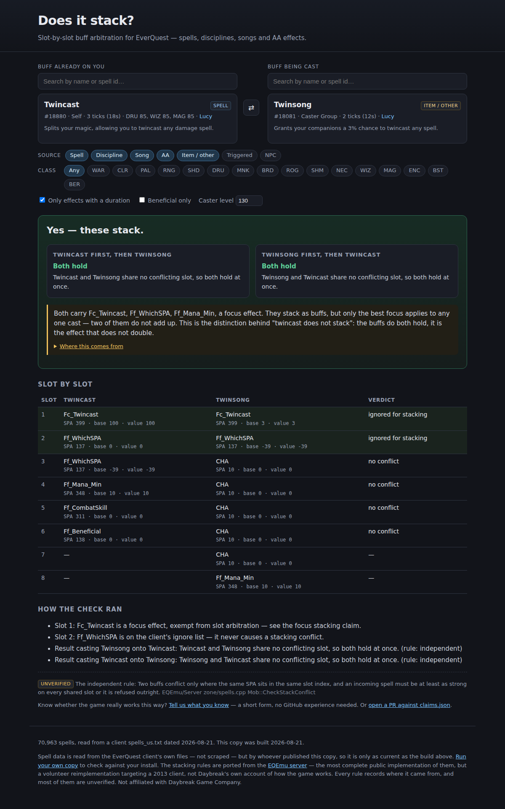

# Does it stack?

A static site that answers one question about EverQuest: **if I already have buff A,
will buff B land — and what happens to A if it does?**

It works on anything the game treats as a spell — buffs, disciplines, bard songs,
AA-granted effects, item clickies, procs — because all of them are rows in the same
spell table.



## Why not just read Lucy?

[Lucy](https://lucy.allakhazam.com/) will show you both spells, but you still have to do
the arbitration in your head: line up the effect slots, decide which SPAs count, compare
the values, and remember the exceptions. This does that part, and shows its work.

The classic example, and the one this project started from:

- [Savage Spirit XVII](https://lucy.allakhazam.com/spell.html?id=70855&source=Live) (berserker AA) — SPA 496 in **slot 2**
- [Prophet's Gift of the Ruchu](https://lucy.allakhazam.com/spell.html?id=6273&source=Live) (shaman epic) — SPA 496 in **slot 10**

Same effect, different slot index, so they stack — but SPA 496 is a *non-cumulative*
modifier, so only the larger of the two actually applies. Both halves of that answer
matter, and the site says both.

## Where the answers come from

Daybreak is the source of truth. Everything else in this list is a reading of the game
by someone who does not work on it, this project included.

| | Source |
| --- | --- |
| Every spell value — name, class levels, slots, SPA ids, base/limit/max, formulas, durations, mana, targets, stacking groups, descriptions | **The client's own files.** Nothing else. |
| SPA names | **Daybreak's [enumerated SPA list](https://forums.daybreakgames.com/eq/index.php?threads/enumerated-spa-list.206288/)**, kept verbatim at `tools/reference/daybreak-spa-list.txt` |
| Which effects are focus effects | **Daybreak's list**, by its own `Fc_` and `Ff_` prefixes |
| Live stacking groups | **`SpellStackingGroups.txt`**, shipped with the client |
| Field offsets in `spells_us.txt` | [rumstil/eqspellparser](https://github.com/rumstil/eqspellparser) |
| Target type labels | eqspellparser, which is what Lucy's presentation follows |
| Level-scaled values and durations | Local base/max/calc, run through EQEmu's and eqspellparser's formula tables |
| The stacking rules | [EQEmu](https://github.com/EQEmu/Server) — see below |

`tools/spells.mjs` imports nothing but Node built-ins, so no part of the parser consults
any of the third-party sources. `npm run verify:data` proves the result end to end: it
re-reads `spells_us.txt` with a separate parser that keeps its own field offsets and
diffs every spell against the built dataset — 2.5 million values, exiting non-zero on a
single mismatch.

### Why the rules are the weak part

The stacking algorithm is ported from EQEmu, and that is the least well-sourced thing
here. EQEmu is a volunteer reimplementation targeting the 2013 RoF2 client. It is the
most complete public account of these rules and the reason this project could be written
at all — but it is someone's reading of the game, and this repo has already found four
places where it diverges from live:

- Its `EFFECT_COUNT` caps at twelve slots. Live spells run to 67, and reading only the
  first twelve changed thousands of verdicts.
- Its stacking ignore list omits focus effects that do stack, and its tail past RoF2 is
  self-described as guesswork.
- Its non-cumulative SPA handling was committed with no source cited, and six of those
  seven claims still have nothing behind them.
- Its `IsFocusEffect` mapping is right where a name-based reading of Daybreak's own SPA
  list would have been wrong — a reminder it cuts both ways.

So `implementation` evidence can never be rated above `supporting`. It corroborates; it
never settles. **Every rule the engine applies is registered in
[`claims.json`](claims.json) with its provenance, most of them `unverified`**, and a
verdict shows where the rule that decided it came from. That is the honest position, not
a gap to paper over — and it is what makes the rules correctable by anyone who knows
better.

```bash
npm run claims       # every claim and its derived status
npm run verify       # re-runs the machine-checkable evidence against your spell files
npm run verify:data  # re-parses the spell file and diffs it against the built dataset
```

## How the rules work

EverQuest arbitrates buffs slot by slot: two spells conflict only where the **same** SPA
sits in the **same** slot index. When they do conflict, the incoming spell has to be at
least as strong on *every* shared slot or it is refused outright.

**Slot counts run to 100.** Twelve is a RoF2-era limit that EQEmu still carries as
`EFFECT_COUNT`, and live spells long outgrew it — Aria of Kenburk Rk. III has 22, 2,612
spells in the current file have more than twelve, and the longest has 67. The engine and
the slot table impose no ceiling of their own. Since no live spell reaches 100 yet, the
top of the range is covered by fixtures built at the full hundred rather than left to
chance.

On top of that sit the special cases:

| Rule | Effect |
| --- | --- |
| Live stacking groups | Two spells in one `SpellStackingGroups.txt` group never coexist; rank decides which wins |
| Focus effects | Exempt from slot arbitration — they stack regardless of slot |
| Ignore list | 84 further SPAs (counters, vision, limits…) never cause a conflict |
| SPA 148 / 149 | Explicit block and overwrite commands carried by the spell itself |
| Blank slots | SPA 254, and SPA 10 spacers with base 0, are invisible to arbitration |
| Bard songs | A song and a non-song beneficial spell always stack |
| Negative AC | AC debuffs skip arbitration, so things like Sun's Corona and Glacier Breath coexist |
| Snare vs. run speed | A snare already in place refuses a movement buff |
| DoT vs. regen | A DoT will not overwrite regen, but does block a regen spell landing after it |
| Complete Heal | Never stacks or overwrites, ever |
| Group vs. single | The single-target version of a line will not replace the group version |

The engine in [`web/engine.js`](web/engine.js) is a port of `Mob::CheckStackConflict`
from EQEmu (`zone/spells.cpp`). Server-side inputs that spell data alone cannot know —
existing spell bonuses, Screech and buff-stacker state, resurrection sickness, NPC DoT
ownership — are left out; every rule that made it in is commented with the case it came
from.

### Focus effects

Focus effects — the ones that modify a spell you cast rather than doing something
themselves — behave differently from ordinary buffs in two ways. Both were reported by
Sancus after the project went up, and both are recorded in `claims.json`.

**They stack regardless of slot.** Daybreak's list names 81 SPAs with an `Fc_` or `Ff_`
prefix, so which effects are focus effects is published rather than inferred. The engine
exempts all of them from slot arbitration.

**Only the best one applies.** When several foci could affect the same cast, the game
uses the largest rather than adding them. So two focus buffs can stack and still not
give you both benefits, and the tool says so. The exceptions are the proc-type foci —
**339 Fc_CastProc** and **383 Fc_CastProcNormalized** — which fire independently and can
all land on one cast.

That pair is the answer to "twincast doesn't stack". Two twincast buffs *do* both hold;
what does not double is the effect. The buffs stack, the focus is best-only, and
conflating those two is what makes the mechanic confusing.

Both claims are `corroborated`: a named practitioner reporting first-hand, with
Daybreak's own naming and EQEmu's implementation agreeing. That is enough for the engine
to act on, and it does — the verdicts changed when the evidence did. They are not
`confirmed`, which is reserved for Daybreak stating the behaviour or a parse measuring
it, so the site attributes rather than asserts.

### Non-cumulative effects

A handful of SPAs land on you together but are not added together; the game keeps the
larger value. The tool warns when a stacking pair shares one, and shows the evidence
behind the warning — because the evidence differs sharply between them.

Seven qualify, identified from `zone/bonuses.cpp` in EQEmu, where they keep the larger
magnitude instead of the `+=` an ordinary bonus uses: **185** Skill Damage Mod 1,
**186** Min Damage Done Mod, **459** Skill Damage Mod 2, **482** Skill Base Damage Mod,
**496** Critical Melee Damage Mod Max, **503** Melee Damage Position Mod, **505** Damage
Taken Position Mod.

**Only 496 has a primary source**, and it is not EQEmu — it is Daybreak. Of all 70,963
spells, exactly 53 descriptions contain the word "non-cumulative", and every one of them
carries SPA 496; none says it without. EQEmu independently agrees, which corroborates
but does not establish.

The other six rest on uncited emulator code. 185/186/459 came from a 2016 mackal commit
whose message body is empty; 503/505 from KayenEQ's PR #1454 and 482 from #1474, each
asserting the behaviour with no source given. The site marks those six unverified and
says so in the warning.

Two caveats apply to all seven:

- The larger value wins **within one bonus bucket**. Spell, AA and worn-item bonuses are
  summed at use time, so a worn item effect and a buff can still add. Two buffs — the
  case this tool compares — are both in the spell bucket.
- 185, 459, 482, 503 and 505 are additive when they arrive as a worn item bonus rather
  than as a buff.

Status is derived from evidence, not written by hand, so **adding a primary source
removes the hedging on the next build with no code change**. If you can settle one of
the six, see [CONTRIBUTING.md](CONTRIBUTING.md) — the parse protocol is there.

## Searching

The search box filters by name or spell id, narrowed by two things:

**Class** — the sixteen classes, matching either a spell the class can learn or one it
only ever reaches by triggering. Side-effect spells usually carry no class levels of
their own, so the build borrows the levels of whatever triggers them; that is why a
ranger search turns up *Jolting Swings Strike* and not just *Jolting Swings*.

**Source** — where the effect comes from:

| | |
| --- | --- |
| **Spell** | scribed by a class at a normal level |
| **Discipline** | flagged as a combat skill |
| **Song** | usable by bards, not a combat skill |
| **AA** | granted by an alternate ability — the class level reads 254 |
| **Item / other** | see below |
| **Triggered** | fired by another spell as a proc, recourse or side effect |
| **NPC** | flagged castable by NPCs only |

### On "Item / other"

**The client's spell files do not record which item grants an effect.** Items live
server-side; nothing in `spells_us.txt` links a clicky to its item. So this bucket is a
residual — everything no class can learn, nothing else in the file triggers, and that is
not flagged NPC-only. Clickies, procs and worn effects land there, which is what you
want, but so do NPC spells that simply lack the NPC flag. Roughly 27,000 rows.

Pairing it with **Beneficial only** and **Only effects with a duration** gets close to
"things an item can put on me". Treat the label as a deduction, not a fact, and follow
the Lucy link when it matters — Lucy has an item database and can tell you the real
source.

## Data files

Everything comes from the four spell files that ship with the live client:

```
spells_us.txt                      the spell table itself (166 caret-delimited fields)
spells_us_str.txt                  cast / land / fade messages
dbstr_us.txt                       descriptions, categories, stacking group names
Resources/SpellStackingGroups.txt  spell → stacking group, rank, type
```

Nothing is scraped, and Lucy is linked from every result so you can check the source.

SPA names are Daybreak's own, which they were not until recently: of the 420 SPAs the
spell file uses, **282 were being displayed under an EQEmu enum identifier no player
would recognise** — `CurrentHP` for HP, `WeaponProc` for Contact Ability,
`SympatheticProc` for Fc_CastProcNormalized. The published list is stored verbatim,
underscores and all, because tidying it would make the label a second-hand reading of a
primary source.

The list stops at 528 and the spell file already uses 529 and 531, so newer SPAs fall
back to EQEmu's naming and then to their bare number. Target type labels are still
third-party naming, and one of those was wrong until a reader's spell dump caught it:
EQEmu calls target type 3 `ST_GroupTeleport`, which reads as a port spell, where it is
the target type on ordinary group buffs and everyone else calls it Caster Group.

### Freshness

**It depends on who built the copy you are looking at.** Build it yourself and it is
exactly as current as your last patch. Visit a hosted copy and you get whatever spell
file its publisher had at deploy time — the footer names that date, and the page warns
after about a patch cycle and again once the data is several patches old. Rebuild and
redeploy after each patch day, or the answers go quietly out of date.

The date shown is the modification time of `spells_us.txt`, which the file itself does
not carry a version for. Copying the file around can reset it.

## Build and run

Node 20+ is the only prerequisite — no dependencies to install.

```bash
npm run build                 # auto-detects the usual Windows install paths
node tools/build.mjs --eq-dir "C:/Users/Public/Daybreak Game Company/Installed Games/EverQuest"

npm run serve                 # builds, then serves dist/ on http://localhost:8000
```

The build writes `dist/`:

```
dist/index.html, app.js, engine.js, spa.js, freshness.js, style.css
dist/data/meta.json          SPA names, ignore list, claims, build stamp
dist/data/index.json         one small row per spell — feeds the search box (~750 KB gzipped)
dist/data/spells/NN.json     full records, sharded by id; only the two you pick get fetched
dist/data/desc/NN.json       descriptions with their #1/%z template tokens resolved
```

`dist/` is deliberately not committed. Re-run the build after each patch day.

### Tests

```bash
npm test
```

Two layers. `tests/engine.fixtures.test.mjs`, `tests/claims.test.mjs` and
`tests/freshness.test.mjs` run on a bare clone with no EverQuest install — hand-built
fixtures covering slot arbitration up to the full 100 slots, SPA 148 blocking, stacking
groups, focus behaviour, the snare and bard rules, plus the claims schema. That is what
CI runs, on Linux and Windows.

`tests/engine.test.mjs` needs a built dataset and skips itself without one — or when
`dist/` is stale, which it detects rather than failing cryptically. It pins the engine
against real spells and cross-checks one against a third-party dump of it, so it doubles
as a check that the field offsets still line up with the current file format.

### Publishing

```bash
tools/deploy_pages.sh                                        # macOS / Linux / Git Bash
powershell -ExecutionPolicy Bypass -File tools\deploy_pages.ps1   # Windows
```

Either script builds, then force-pushes `dist/` as an orphan `gh-pages` commit, which
keeps fifty-odd megabytes of regenerated JSON out of the repo's history.

## Layout

```
claims.json                        what this project claims about the game, and the evidence
CONTRIBUTING.md                    the evidence standard and the parse protocol
tools/reference/                   primary sources, kept verbatim (Daybreak's SPA list)
tools/spells.mjs                   spell file parser, formulas, description tokens,
                                   source classification, spell-reference graph
tools/spa_names.mjs                SPA names and the focus set, from Daybreak's list
tools/build.mjs                    dataset + site build
tools/claims.mjs                   claims loader, validator, status derivation
tools/verify_claims.mjs            re-runs machine-checkable evidence
tools/verify_dataset.mjs           diffs the built dataset against the spell file
tools/gen_spa_js.mjs               generates web/spa.js from repo files (no game needed)
tools/gen_spa_meta.mjs             regenerates spa_meta.json from an EQEmu checkout
tools/spa_meta.json                stacking ignore list and focus lists, from EQEmu
tools/serve.mjs                    dependency-free static server for dist/
web/engine.js                      the stacking rules
web/app.js                         search, pickers, rendering
web/freshness.js                   how stale the shipped data is
tests/                             node:test — fixtures and claims run anywhere
```

## Known gaps

- Caster level is a single input applied to both spells; the game tracks it per buff.
  It defaults to 130, the live cap — raise `MAX_PLAYER_LEVEL` in `tools/spells.mjs` on
  the expansion that raises it, and everything else follows from there.
- Six of the seven non-cumulative SPAs rest on uncited EQEmu implementation rather than
  any primary source. See above, and `claims.json` for each one.
- Most stacking rules are `unverified` for the same reason, including `slot-arbitration`,
  the rule nearly every answer rests on. Settling that one would be the single most
  valuable contribution here.
- Slot effects are named, not phrased — you get "Critical Melee Damage Mod Max", not
  Lucy's full "Increase Critical Melee Damage by 300% of Base Damage".
- "Item / other" is a residual bucket, not a real source flag — see above.
- Formula 123 (random range) is evaluated at its midpoint.
- Bard instrument modifiers are not applied to song values.
- SPAs past 528 have no published name and fall back to EQEmu's or their number.

## Contributing

Bug fixes and features: normal pull request.

Claims about how the game behaves are different — they live in
[`claims.json`](claims.json) with their evidence, and a PR that settles one is usually a
ten-line diff and no code.

**You do not need to touch git for that.** Every claim the site hedges on links to an
[evidence form](https://github.com/fadwen/doesitstack/issues/new?template=mechanic-evidence.yml&labels=evidence),
prefilled with the claim you were looking at; it asks what you know and where it came
from. Someone else turns it into a PR and credits you. The evidence standard and the
parse protocol are in [CONTRIBUTING.md](CONTRIBUTING.md) for anyone who wants them.

## Credits

- **Daybreak Game Company** — the client files everything here is read from, and the
  published SPA list that names it
- **Sancus** — focus effect behaviour, the slot-count limit, and the SPA list
- [EQEmu/Server](https://github.com/EQEmu/Server) — the stacking algorithm this engine is
  ported from. Corroborating, not authoritative
- [rumstil/eqspellparser](https://github.com/rumstil/eqspellparser) — spell file field layout
- [Lucy](https://lucy.allakhazam.com/) — the reference every EverQuest player already trusts

Not affiliated with or endorsed by Daybreak Game Company. EverQuest is a trademark of
Daybreak Game Company LLC.
